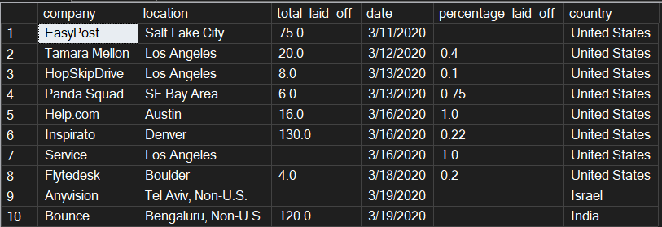
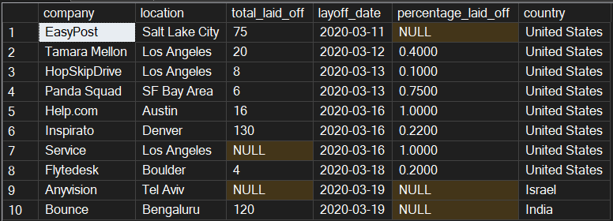

# Layoffs Data Cleaning with SQL Server

A beginner-friendly data cleaning project in **Microsoft SQL Server (T-SQL)**. It turns a messy, text-only export of global tech layoffs into a clean, correctly typed table that is ready for analysis, and it proves the result with validation checks.

## Project at a glance

| | |
|---|---|
| **Tool** | Microsoft SQL Server 2017 or later, SQL Server Management Studio (SSMS) |
| **Data** | [`data/layoffs.csv`](data/layoffs.csv), layoffs.fyi data from Kaggle |
| **Size** | 4,615 rows and 11 columns before cleaning, 4,613 rows after |
| **Skills shown** | Data import, `TRIM`, `NULLIF`, `TRY_CAST` / `TRY_CONVERT`, type conversion, `ROW_NUMBER()` duplicate removal, validation queries |
| **Script** | [`sql/layoffs_data_cleaning.sql`](sql/layoffs_data_cleaning.sql) |

## Before and after

The same 10 rows (the oldest layoffs), before and after cleaning.

**Raw data (`layoffs_raw`)**: numbers like `75.0`, blanks, `, Non-U.S.` in city names, and `m/d/yyyy` text dates.



**Clean data (`layoffs_clean`)**: whole numbers, real `NULL` values, plain city names, and `yyyy-mm-dd` dates.



## How the data flows

```
layoffs_raw        original import, never edited
      |
layoffs_Staging    working copy: text standardized, types converted
      |
layoffs_Staging2   duplicates removed (one row per layoff event)
      |
layoffs_clean      final cleaned table
```

The raw table is never changed, so every cleaning step can be repeated and checked against the original.

## How the data was imported

The CSV was loaded with the SQL Server Import and Export Wizard (Flat File Source). Every column was loaded as text (`NVARCHAR`), so nothing is rejected or changed on the way in.

- Text qualifier `"`, because some values contain commas, for example `"Vancouver, Non-U.S."`
- Code page `65001 (UTF-8)`, for names with non-English characters
- Column width set to 600 characters, because the article links are long

This is why the raw table shows values like `96.0`, empty text for missing numbers, and dates written as `9/23/2026`.

## Problems found and how they were fixed

| Problem in the raw data | Fix |
|---|---|
| Everything stored as text (`96.0`, `9/23/2026`) | Converted to `INT`, `DATE` and `DECIMAL` types |
| Blanks stored as empty text | Converted to `NULL` before changing types, so a missing number never becomes `0` and a blank date never becomes `1900-01-01` |
| Extra spaces around names | `TRIM` on every text column |
| `, Non-U.S.` added to some city names, so one city counted as two places | Suffix removed, because the `country` column already holds the country |
| Four locations that were only `Non-U.S.` (no city) | Set to `Unknown` |
| Three company names ending in "copy" | Word removed |
| Seven companies spelled two ways (for example `Tiktok` and `TikTok`) | Merged to one official spelling |
| `UAE` and `United Arab Emirates` | Merged to `United Arab Emirates` |
| Two rows with no country (Berlin, Montreal) | Filled as Germany and Canada, because the city in the same row makes it clear |
| Missing stage, industry and location | Set to `Unknown` (stage already used `Unknown`) |
| `Company exec` and `Company executive` | Merged to `Company executive` |
| `Read more at:` stored as a source | Set to `NULL`, because it is not a source |
| Duplicate layoff events (for example Beyond Meat and Cazoo, each reported twice) | Removed with `ROW_NUMBER()`, keeping the earliest `date_added` |

## Final data types

| Column | Type |
|---|---|
| `total_laid_off` | `INT` |
| `layoff_date`, `date_added` | `DATE` |
| `percentage_laid_off` | `DECIMAL(7,4)` (0 to 1, where 1 = 100%) |
| `funds_raised` | `DECIMAL(18,4)` |
| All other columns | text |

## Key decisions

- **Missing numbers stay `NULL`, never `0`.** A blank means "not reported", not "zero layoffs". `SUM` and `AVG` skip `NULL`, so totals stay accurate.
- **Duplicates are removed last**, after text is standardized and dates are real dates. Rows are then compared on clean values, and "keep the earliest `date_added`" really means the earliest.
- **`source` and `date_added` are not used to find duplicates.** They describe the news report, not the layoff. The same layoff can be reported by two outlets on different days, and including those columns would hide the duplicates.
- **Only clear name matches are merged.** `Mara` (Kenya) and `MARA` (USA) are different companies, so they were left alone.
- **Rows with missing layoff numbers are kept.** 748 rows have neither `total_laid_off` nor `percentage_laid_off`, but they still hold a company, a date and an industry. Filtering them out is an analysis decision, not a cleaning step.

## Validation

The script checks its own work, both during cleaning (each fix has a preview and an "expect 0 rows" check) and in a final validation section that covers:

- Row counts: raw vs clean (the difference is the duplicates removed)
- Data types of every column
- No duplicates left
- No percentages below 0 or above 1, no negative layoffs
- No dates in the future and no placeholder dates (before 1990)
- No missing countries
- Count of rows still missing layoff numbers, and rows set to `Unknown`

## Limitations

- **`funds_raised` has no stated unit or currency** in the file. Other versions of this dataset use USD millions, but this file does not confirm it, so values are kept exactly as provided. One value (Netflix, 121,900) is far above the rest and is left as provided.
- A few cells hold more than one place (for example `Luxembourg, Raleigh`) and were left as they are.
- A few near-duplicates differ in one detail such as `funds_raised` or `percentage_laid_off` (for example FNZ and Oda), so they are kept as separate rows.
- One value looks wrong in the source: TaskUs (2022-06-21) shows 52 people laid off at 0%, which is probably a missing percentage. It is left as provided.
- Company names are not unique IDs. Several different companies are called `Loop`.
- Exported percentages appear without a leading zero (`.1700`). This is a formatting detail of the export, and the value is still 0.17.

## How to run it

1. Create a database called `DataCleaningLab` in SQL Server (2017 or later).
2. Import [`data/layoffs.csv`](data/layoffs.csv) as the table `layoffs_raw` with the settings in "How the data was imported".
3. Open `sql/layoffs_data_cleaning.sql` in SSMS.
4. Press F5 to run the whole script. It drops and rebuilds the staging and clean tables each time, and never touches `layoffs_raw`, so it is safe to re-run. To step through instead, highlight one section at a time, and run each `ALTER COLUMN` on its own before the queries that use the new type.
5. Check the last section of results: 4,615 rows in `layoffs_raw` and 4,613 in `layoffs_clean`, and no rows from the "expect 0 rows" checks.

## Repository contents

```
layoffs-sql-data-cleaning/
├── README.md
├── sql/
│   └── layoffs_data_cleaning.sql
├── data/
│   └── layoffs.csv
└── images/
    ├── before_raw.png
    └── after_clean.png
```

## Data source

`data/layoffs.csv` is the raw export used in this project, included so the script can be reproduced. The data comes from layoffs.fyi, shared on Kaggle, and belongs to its original source. See the dataset's Kaggle page for the license terms.

## Author

**Kolawole Opeyemi Oscar**, QA Engineer moving into data analysis.

- Portfolio: https://oscarcodelab.github.io/
- LinkedIn: https://www.linkedin.com/in/kolawole-opeyemi-3063231b2
